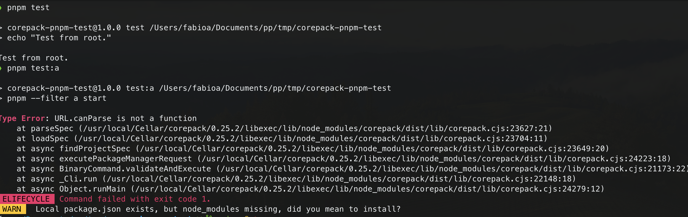

## `URL.canParse` Error in Corepack Brew Formula with pnpm and `use-node-version`

**Description:**

This repo can be used to reproduce an issue "Type Error: URL.canParse is not a function" encountered specifically when using `pnpm` from within npm scripts executed using `pnpm`. This occurs when using corepack to install the package manager for the project (`corepack enable`) and [pnpm node settings](https://pnpm.io/npmrc#nodejs-settings) via `use-node-version`.

**Steps to Reproduce:**

1. Install corepack using brew `brew install corepack`.
2. Use corepack to install the package manager for this project `corepack enable`.
3. Run `pnpm test` (this works).
4. Run `pnpm test:a` (this fails with the error).

**Observed Behavior:**

- `pnpm -v` executed directly works successfully.
- `pnpm pnpm -v` (invoking `pnpm` from an npm script) results in the error.

**Expected Behavior:**

- Both commands should run successfully, pnpm CLI itselft should always be executed with the node version specified by the corepack brew formula.

**Suspected Cause:**

- Potentially incorrect Node.js version inheritance when invoking `pnpm` from within an npm script.
- Possible conflict between corepack's Node.js dependency and `use-node-version` within nested `pnpm` calls.

**Additional Information:**

- Corepack brew formula version: 0.25.2
- Global pnpm version (installed by corepack brew formula): 7.14.1
- Project pnpm version: 8.15.4
